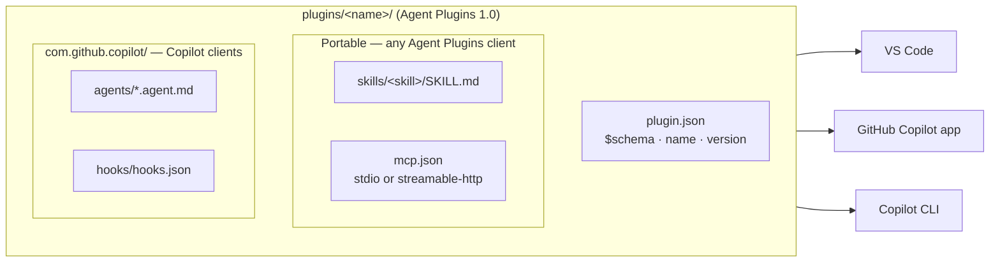

# 🧩 Copilot Agent Plugins Demo

**One package, every Copilot surface.** This repository is a plugin **marketplace** with three [Agent Plugins 1.0](https://agent-plugins.org/) plugins. Each plugin bundles a **skill**, a **custom agent**, **hooks** and an **MCP server**, and works in **VS Code**, the **GitHub Copilot app** and **GitHub Copilot CLI**.

| Plugin | Story | Skill | Custom agent | Hooks | MCP server |
|---|---|---|---|---|---|
| 🚢 [**ship-ready**](plugins/ship-ready) | "Are we ready to release?" | `release-notes` | `release-captain` | `sessionStart` release context · `postToolUse` audit trail | `ship-ready` — local stdio (readiness score, changelog, semver) |
| 🛡️ [**secure-code-guardian**](plugins/secure-code-guardian) | "Let agents move fast, safely" | `threat-model` | `security-reviewer` | `sessionStart` policy · **`preToolUse` guardrail** (blocks secrets & destructive commands) | `guardian` — local stdio (secret scan, OSV.dev vulnerabilities) |
| 📚 [**docs-onboarding-buddy**](plugins/docs-onboarding-buddy) | "Productive on day one" | `codebase-tour` | `onboarding-guide` | `sessionStart` repo map | `microsoft-learn` — **remote** streamable-http |

> 🎤 Presenting? Follow [**DEMO-SCRIPT.md**](DEMO-SCRIPT.md), a ~20-minute talk track with exact prompts, expected results and fallbacks.

---

## 🏗️ How a plugin is built



```text
plugins/secure-code-guardian/
├── plugin.json                      # manifest (closed schema, $schema = Agent Plugins 1.0.0)
├── mcp.json                         # portable MCP config → node ${PLUGIN_ROOT}/mcp/server.mjs
├── skills/threat-model/             # portable skill (SKILL.md + references/)
├── com.github.copilot/              # Copilot-specific extension namespace
│   ├── agents/security-reviewer.agent.md
│   └── hooks/hooks.json             # Copilot hook format: version 1, camelCase events, bash + powershell
├── scripts/                         # hook scripts (Node, cross-platform)
├── mcp/                             # zero-dependency MCP server
└── README.md
```

Design choices that make one package work on every surface:

| Concern | Choice | Why |
|---|---|---|
| Manifest | Root `plugin.json` with `"$schema": "https://agent-plugins.org/schemas/1.0.0/plugin.schema.json"` | Opts into Agent Plugins semantics in VS Code, the Copilot app and the CLI |
| Skills & MCP | `skills/` and `mcp.json` at the plugin root | The only two **portable** component types in the standard |
| Agents & hooks | Under `com.github.copilot/` | These are client-specific, so they live in the Copilot namespace. Other clients ignore that folder. |
| Hook format | `"version": 1`, camelCase events, `bash` + `powershell` commands | Copilot CLI and the app run it natively, and the VS Code Local agent maps it automatically |
| Hook payloads | Scripts accept `toolName`/`toolArgs` **and** `tool_name`/`tool_input` | Each harness sends a different payload shape |
| Paths | `${PLUGIN_ROOT}` in hook commands and MCP `args` | Plugins are installed outside your workspace. `command` stays the bare token `node`, as the spec requires. |
| Runtime | Node ≥ 18 only, **zero npm dependencies** in the plugins | Nothing to install on the demo machine, and the same code runs on macOS, Linux and Windows |
| Self-containment | Shared helpers are *copied* into each plugin (CI checks the copies stay identical) | The spec forbids package paths that escape the plugin root |

---

## 📥 Install

Requirements: **Node.js 18+** on `PATH`, plus the Copilot client you want to use. Pick your surface.

### Copilot CLI

```bash
# 1. Register the marketplace (one time)
copilot plugin marketplace add sekar3s/copilot-agent-plugins-demo

# 2. Browse and install
copilot plugin marketplace browse copilot-agent-plugins-demo
copilot plugin install ship-ready@copilot-agent-plugins-demo
copilot plugin install secure-code-guardian@copilot-agent-plugins-demo
copilot plugin install docs-onboarding-buddy@copilot-agent-plugins-demo

# 3. Verify
copilot plugin list
copilot skill list | grep -E "release-notes|threat-model|codebase-tour"
```

Inside an interactive session you can do the same with `/plugin`, then check `/agent`, `/skills` and `/mcp`.

<details>
<summary>Other CLI install options</summary>

```bash
# Straight from GitHub, one plugin (direct installs are deprecated in favor of marketplaces)
copilot plugin install sekar3s/copilot-agent-plugins-demo:plugins/ship-ready

# Load a local checkout for a single session (great while developing)
copilot --plugin-dir ./plugins/ship-ready

# Register a local clone as a marketplace (plugins load live from disk, edits apply next session)
copilot plugin marketplace add /path/to/copilot-agent-plugins-demo
```
</details>

### GitHub Copilot app

1. Click **Customize** in the sidebar, then **Plugins**.
2. Click the ⚙️ marketplace-settings icon next to the marketplace dropdown and add `sekar3s/copilot-agent-plugins-demo`.
3. Pick **copilot-agent-plugins-demo** in the marketplace dropdown, then click **Install** on each plugin.
4. Check that each plugin shows under **Customize → Installed**. Its agents appear in the agent picker (or type `/agent`).

> Plugins installed with Copilot CLI are shared with the Copilot app, because both run the same Copilot runtime.

### VS Code

Make sure `chat.plugins.enabled` is `true`. Then choose one option:

**A. Marketplace (recommended)** — add this to your user `settings.json`:

```jsonc
"chat.plugins.marketplaces": ["sekar3s/copilot-agent-plugins-demo"]
```

Open the Extensions view (`⇧⌘X` / `Ctrl+Shift+X`), search `@agentPlugins`, and select **Install** on each plugin. You can also run **Chat: Open Customizations** → **Plugins** → **Browse Marketplace**.

**B. Reuse CLI installs** — VS Code automatically discovers plugins you installed with Copilot CLI from GitHub, which live in `~/.copilot/installed-plugins/`.

**C. Local clone** — point VS Code at the plugin folders:

```jsonc
"chat.pluginLocations": {
  "/path/to/copilot-agent-plugins-demo/plugins/ship-ready": true,
  "/path/to/copilot-agent-plugins-demo/plugins/secure-code-guardian": true,
  "/path/to/copilot-agent-plugins-demo/plugins/docs-onboarding-buddy": true
}
```

Then check each one:

- [ ] **Extensions → Agent Plugins – Installed** lists the three plugins.
- [ ] **Chat: Configure Skills** shows `release-notes`, `threat-model` and `codebase-tour`.
- [ ] **MCP: List Servers** shows `ship-ready`, `guardian` and `microsoft-learn`. Start them if they're stopped.
- [ ] The agent picker in Chat shows **release-captain**, **security-reviewer** and **onboarding-guide**.
- [ ] Output panel → **GitHub Copilot Chat Hooks** shows the hooks firing when you send a message.

### Recommend the plugins to your whole team

Commit `.github/copilot/settings.json` in a project repository. VS Code and Copilot CLI will offer the plugins to everyone who opens it:

```json
{
  "extraKnownMarketplaces": {
    "copilot-agent-plugins-demo": {
      "source": { "source": "github", "repo": "sekar3s/copilot-agent-plugins-demo" }
    }
  },
  "enabledPlugins": {
    "secure-code-guardian@copilot-agent-plugins-demo": true,
    "ship-ready@copilot-agent-plugins-demo": true
  }
}
```

Enterprises can go further with [managed settings](https://docs.github.com/en/copilot/how-tos/administer-copilot/manage-for-enterprise/use-managed-settings/get-started). For example, force-enable `secure-code-guardian` and set `allowManagedHooksOnly` so its guardrail can't be switched off.

---

## ▶️ Use

| I want to… | Try this prompt | Uses |
|---|---|---|
| Know if we can release | *(agent: release-captain)* `Are we ready to ship?` | agent · MCP · skill · hooks |
| Draft release notes | `Draft release notes for v1.1.0` | skill `release-notes` |
| Review security | *(agent: security-reviewer)* `Do a security review of this repo.` | agent · MCP (OSV.dev) |
| See the guardrail | `Show me what's in the .env file` | hook `preToolUse` → **blocked** |
| Threat-model a feature | `Threat-model the product API` | skill `threat-model` |
| Onboard | *(agent: onboarding-guide)* `Onboard me to this repo` | agent · hook context |
| Generate a tour | `Give me a codebase tour and save it as ONBOARDING.md` | skill `codebase-tour` |
| Get official docs | `How do I deploy this to Azure Container Apps? Cite Microsoft Learn.` | remote MCP `microsoft-learn` |

How agents are named on each surface:

| Surface | How to pick an agent |
|---|---|
| VS Code | Agent picker in the Chat view |
| Copilot app | Agent picker in the prompt box, or `/agent` |
| Copilot CLI | `/agent` interactively, or `copilot --agent ship-ready:release-captain` (plugin agents are named `<plugin>:<agent>`) |

Hook audit logs are written to `~/.agent-plugins-demo/<plugin>/audit.log`, or to `$PLUGIN_DATA` when the client provides it.

---

## 🧪 Develop & validate

```bash
npm install          # dev-only dependency: ajv (the plugins themselves have zero dependencies)
npm run validate     # validates every manifest against the official Agent Plugins 1.0 schemas + semantic rules
npm test             # 64 tests: guardrail policy (both payload shapes), hooks, MCP servers over stdio, validator
```

[`tools/validate.mjs`](tools/validate.mjs) checks:

- `plugin.json` and `mcp.json` against the vendored [official schemas](tools/schemas).
- Name rules, and that each skill's folder name matches its front matter.
- Agent front matter.
- `hooks.json` events and commands.
- That every `${PLUGIN_ROOT}/…` reference points to an existing file.
- That no path escapes the plugin root.
- That `marketplace.json` names and versions match each plugin.
- That shared helper copies stay identical.

CI runs all of this on Linux, macOS and Windows ([`.github/workflows/validate.yml`](.github/workflows/validate.yml)).

**Releasing a new plugin version:** bump `version` in both `plugins/<name>/plugin.json` and `.github/plugin/marketplace.json`. Then run `copilot plugin update --all` (CLI) or **Extensions: Check for Extension Updates** (VS Code).

---

## 🩺 Troubleshooting

| Symptom | Fix |
|---|---|
| Plugin doesn't appear in VS Code | Check that `chat.plugins.enabled` is `true`. Run **Developer: Reload Window**. Confirm the marketplace entry is `sekar3s/copilot-agent-plugins-demo`. |
| `Skill not found`, or the agent ignores a skill | You probably have a lot of other skills and plugins installed, so the session's skill list gets truncated. For demos, use a clean profile: `export COPILOT_HOME=~/.copilot-demo` (CLI/app) or `code --profile "Agent Plugins Demo"` (VS Code). Then install only these plugins. |
| `No such agent: release-captain` (CLI) | Use the namespaced name: `--agent ship-ready:release-captain`. |
| MCP server fails to start | Run `node --version` (needs ≥ 18). Check that `node` is on the `PATH` the client inherits. In VS Code, see **MCP: List Servers → Show Output**. |
| `check_dependencies` says it can't reach OSV.dev | Your network or proxy blocks `api.osv.dev`. The tool falls back gracefully; use `npm audit` instead. |
| Hooks don't fire in VS Code | Check that `chat.useHooks` is on and the workspace is trusted. Look at the **GitHub Copilot Chat Hooks** output channel. |
| Every tool call is denied in the CLI | A crashing `preToolUse` command hook fails closed. Run `echo '{}' \| node plugins/secure-code-guardian/scripts/guard.mjs`; it must exit 0 with no output. |
| A plugin update isn't picked up | Bump `version` in `plugin.json` **and** `marketplace.json`, then run `copilot plugin marketplace update` / `copilot plugin update --all`. |

## 🔐 Security notes

Plugins run code on your machine: hooks and local MCP servers. These plugins:

- Read your repository **read-only**. Only the agents write files, and only when you ask.
- Make network calls only to `api.osv.dev` (dependency check) and `learn.microsoft.com` (docs).
- Never print secret values. Findings are masked.
- Contain no credentials. Review the code before installing, as you would with any plugin.

## 📚 References

- [Agent plugins in VS Code](https://code.visualstudio.com/docs/agent-customization/agent-plugins)
- [Agent Plugins 1.0 specification](https://github.com/agentplugins/agent-plugins-spec/blob/main/spec/1.0.0.md)
- [Copilot CLI plugin reference](https://docs.github.com/en/copilot/reference/copilot-cli-reference/cli-plugin-reference)
- [Copilot hooks reference](https://docs.github.com/en/copilot/reference/hooks-reference) · [VS Code hooks](https://code.visualstudio.com/docs/agent-customization/hooks)
- [Customizing the GitHub Copilot app](https://docs.github.com/en/copilot/how-tos/github-copilot-app/customize-github-copilot-app)

MIT © sekar3s
