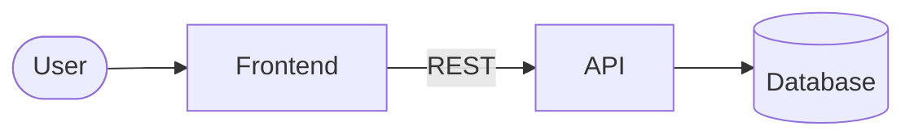

# Welcome to {{project name}} 👋

> Generated with the **codebase-tour** skill (Docs & Onboarding Buddy plugin) · {{date}}

{{Two-sentence elevator pitch: what the project does and for whom.}}

## 🧱 Architecture at a glance



| Component | Folder | Tech | Responsibility |
|---|---|---|---|
| {{Frontend}} | `{{frontend/}}` | {{React + Vite}} | {{…}} |

## 🚀 Run it locally

```bash
{{exact install command}}
{{exact run command(s)}}
```

| Task | Command |
|---|---|
| Test | `{{…}}` |
| Lint | `{{…}}` |
| Build | `{{…}}` |

## 🔎 Follow a request

1. [{{entry file}}]({{path}}) — {{what happens here}}
2. [{{route file}}]({{path}}) — {{…}}
3. [{{repository/service}}]({{path}}) — {{…}}

## 📐 Conventions

- {{naming, error handling, folder layout, commit style}}

## 🧪 Testing

{{Where tests live, how to run a single test, what is mocked.}}

## 🌱 Good first tasks

1. **{{task}}** — [{{file}}]({{path}}) — {{why it is a safe starter}}
2. …
3. …

## 📖 Glossary

| Term | Meaning |
|---|---|
| {{…}} | {{…}} |

## If you only read one thing…

{{One paragraph.}}
