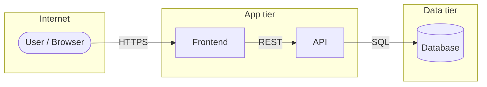

# Threat Model — {{System or feature name}}

> Generated with the **threat-model** skill (Secure Code Guardian plugin) · {{date}}

## 1. Scope

{{One or two sentences describing what is in and out of scope.}}

**Stack:** {{languages, frameworks, data stores, hosting}}

## 2. Data flow & trust boundaries

## 3. Threats

| # | STRIDE | Component | Threat | L | I | Risk | Mitigation | Status |
|---|--------|-----------|--------|---|---|------|------------|--------|
| T1 | Tampering | `api/src/routes/…` | … | M | H | 🔴 High | … | ❌ |

## 4. Top 3 mitigations

1. **…** — why it matters, effort (S/M/L).
2. **…**
3. **…**

## 5. Assumptions & open questions

- …
